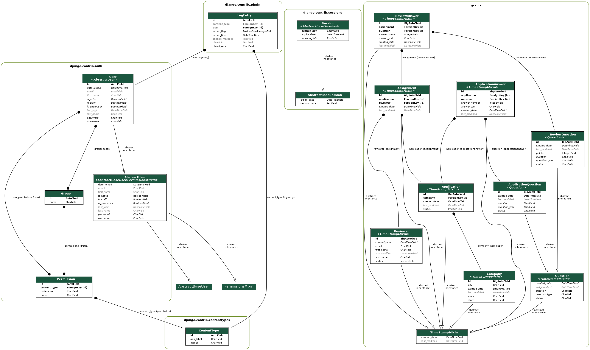

Final Project
=============

::: {.contents}
Table of Contents
:::

Introduction
------------

This project is the development of an API to support an application to
manage the process of evaluating grant applications for corporate social
responsibility programs. Many companies perceive there to be significant
benefit from having corporate social respsonsibility programs that
provide financial and or in-kind products or services to non-profit
organizations. Those benefits include genuinely helping do some good in
the world and helping with recruiting and retention as most people like
to feel like they are working for an organization that serves a higher
purpose in addition to maximizing shareholder value.

In order to derive those benefits companies have to not just make sure
that they are providing grants to worthy organizations, but also engage
employees in the process and share information with them so that they
understand the good that is being done. One way that works really well
to achieve both of those purposes is to engage employees in the process
of evaluating grant applications.

However, this can be administratively burdensome as most often corporate
social responsiblity programs are managed by a small number of
non-technical people, considered to be non-core and operate with modest
financial resources. Keeping the information straight across thousands
of applications and hundreds of employees, each of whom are evaluating
multiple applications can quickly become unwieldy.

This project aims to solve this problem and make it possible for a small
number of people to effectively engage employees to make high quality
evaluations of grant applications. This project is phase one of the
completed application and includes the data models and a REST API built
with [django](https://www.djangoproject.com/) and
[django-rest-framework](https://www.django-rest-framework.org).

Documentation
-------------

[Link to
documentation](https://csci-e-29.github.io/2021sp-final-project-CalebEverett/html/index.html)

Highlights
----------

Below are a few Advanced Python for Data Science highlights:

-   Data model utilizes abstract base classes to propagate common
    features
-   Custom management command with composed
    [luigi](https://github.com/spotify/luigi/) tasks to load sample data
    from [Random Data API](https://random-data-api.com/).
-   Test suite has been implemented with an abstract base class that
    streamlines testing and reduces boilerplate
-   Full self generating [openAPI
    Specification](https://swagger.io/specification/) API documentation
-   Documentation includes:

    -   [PyData Spinx
        Theme](https://pydata-sphinx-theme.readthedocs.io/en/latest/)
    -   [Github actions
        deployment](https://github.com/JamesIves/github-pages-deploy-action)
    -   Data model graph created with [django
        graph\_models](https://django-extensions.readthedocs.io/en/latest/graph_models.html)
        and rendered with
        [sphinx.ext.graphviz](https://www.sphinx-doc.org/en/master/usage/extensions/graphviz.html)
    -   [Google style
        docstrings](https://google.github.io/styleguide/pyguide.html)
        parsed by
        [autodoc](https://www.sphinx-doc.org/en/master/usage/extensions/autodoc.html)
        with the help of
        [napoleon](https://sphinxcontrib-napoleon.readthedocs.io/en/latest/example_google.html)
    -   Django model parameters parsed by autodoc with the help of
        [sphinxcontrib-django](https://pypi.org/project/sphinxcontrib-django2/)
    -   Links to source code with
        [sphinx.ext.viewcode](https://www.sphinx-doc.org/en/master/usage/extensions/viewcode.html)

    Data Model
    ----------

    
